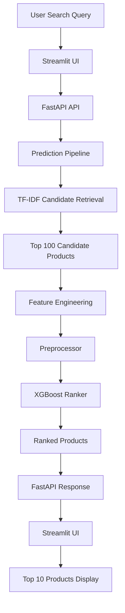
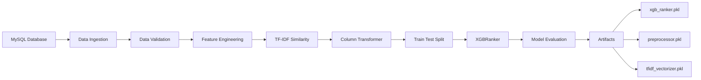
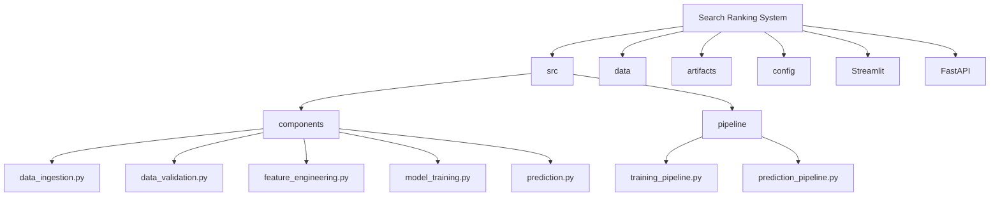
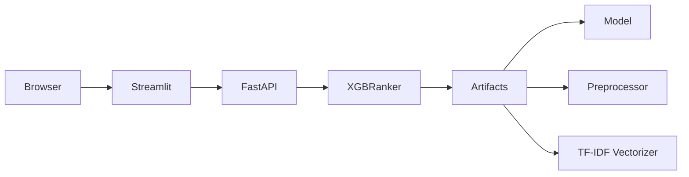
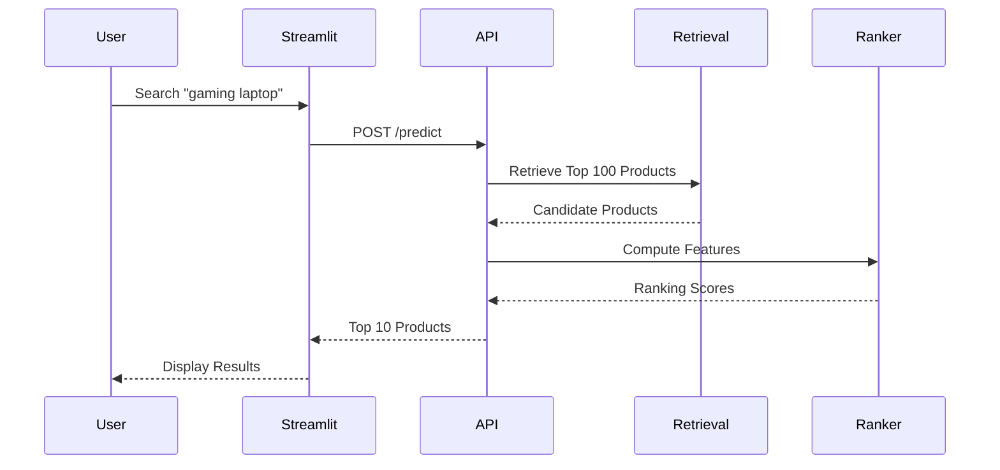

## 🏗️ System Architecture

## 🧠 Machine Learning Pipeline

## 📂 Project Structure

## 🚀 Deployment Architecture

## 🔍 Search Ranking Flow

# 🛒 Search Ranking System

An end-to-end **Amazon-style Search Ranking System** that retrieves candidate products using TF-IDF and ranks them using **XGBoost Learning-to-Rank**, exposed through **FastAPI** and an interactive **Streamlit** interface.

